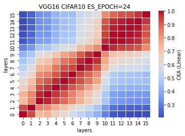
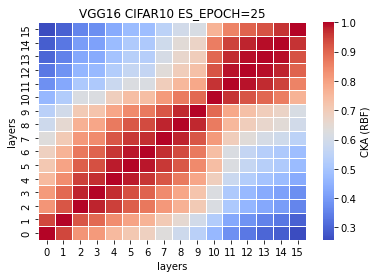
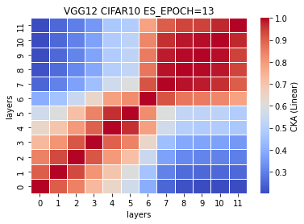
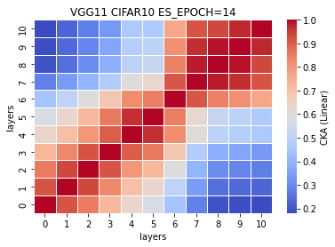
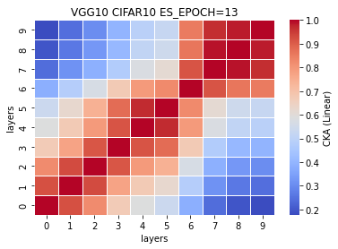
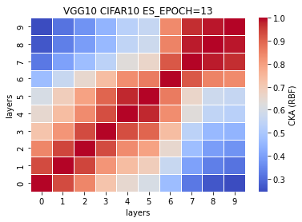

# Content
- [raw VGG16](https://github.com/YHJYH/Machine_Learning/blob/main/projects/Master_Thesis/experiments/vgg16.md#raw-vgg16)
- [CKA layer removal VGG16](https://github.com/YHJYH/Machine_Learning/blob/main/projects/Master_Thesis/experiments/vgg16.md#cka-layer-removal-vgg16)
    - [10% or 4 layers](https://github.com/YHJYH/Machine_Learning/blob/main/projects/Master_Thesis/experiments/vgg16.md#remove-10-params-or-4-conv-layers)
    - [18% or 5 layers](https://github.com/YHJYH/Machine_Learning/blob/main/projects/Master_Thesis/experiments/vgg16.md#remove-18-or-5-conv-layers-vgg11)
    - [18% or 6 layers](https://github.com/YHJYH/Machine_Learning/blob/main/projects/Master_Thesis/experiments/vgg16.md#remove-18-params-or-6-layers-vgg10)
- [random param=0 VGG16]()


## raw VGG16
```
Total params: 33,625,792
Trainable params: 33,625,792
Non-trainable params: 0
----------------------------------------------------------------
Input size (MB): 0.01
Forward/backward pass size (MB): 2.17
Params size (MB): 128.27
Estimated Total Size (MB): 130.46
----------------------------------------------------------------
-data_type=cifar10 -model_type=vgg16 -learning_rate=0.001 -momentum=0.9 -num_epoch=50 -patience=50
```
train_model1_1:
```
----------------------------------------------
Train loss: 0.688125, Valid loss: 0.835164
Updating model file...
Early stopping at: 24
----------------------------------------------
```
features1_1.pt
```
-mode=test -data_type=cifar10 -model_type=vgg16
----------------------------------------------
Test average loss: 1.6674, acc: 0.7581
```
CKA (Linear) plot:


CKA (RBF) plot:


## CKA layer removal VGG16
### remove ~10% params or 4 conv layers
```
Total params: 29,939,392
Trainable params: 29,939,392
Non-trainable params: 0
----------------------------------------------------------------
Input size (MB): 0.01
Forward/backward pass size (MB): 1.61
Params size (MB): 114.21
Estimated Total Size (MB): 115.83
----------------------------------------------------------------
-data_type=cifar10 -model_type=vgg16_N -learning_rate=0.001 -momentum=0.9 -num_epoch=50 -patience=50
```
VGG16_N model (VGG12)<br>
%reduced params = (33638218-29939392)/33638218\*100 = 10.9959%<br>
num. of reduced params = 33638218-29939392 = 3698826
```
def forward(self, x):
        
        x1 = self.conv1(x)
        
        x2 = F.relu(x1)
        x3 = self.conv2(x2)
        
        x4 = F.relu(x3)
        x5 = F.max_pool2d(x4, kernel_size=2, stride=2)
        x6 = self.conv3(x5)
        
        #x7 = F.relu(x6)
        #x8 = self.conv4(x7)
        
        x9 = F.relu(x6)
        x10 = F.max_pool2d(x9, kernel_size=2, stride=2)
        x11 = self.conv5(x10)
        
        #x12 = F.relu(x11)
        #x13 = self.conv6(x12)
        
        #x14 = F.relu(x13)
        #x15 = self.conv7(x14)
        
        x16 = F.relu(x11)
        x17 = F.max_pool2d(x16, kernel_size=2, stride=2)
        x18 = self.conv8(x17)
        
        #x19 = F.relu(x18)
        #x20 = self.conv9(x19)
        
        x21 = F.relu(x18)
        x22 = self.conv10(x21)
        
        x23 = F.relu(x22)
        x24 = F.max_pool2d(x23, kernel_size=2, stride=2)
        x25 = self.conv11(x24)
        
        x26 = F.relu(x25)
        x27 = self.conv12(x26)
        
        x28 = F.relu(x27)
        x29 = self.conv13(x28)
        
        x30 = F.relu(x29)
        x31 = F.max_pool2d(x30, kernel_size=2, stride=2)
        x32 = torch.reshape(torch.flatten(x31), (-1, 512))
        x33 = self.fc1(x32)
        
        x34 = F.relu(x33)
        x35 = self.fc2(x34)
        
        x36 = F.relu(x35)
        x37 = self.fc3(x36)
        
        x38 = F.log_softmax(x37, dim=1)
        
        feature_map = [x1, x3, x6, x11, x18, x22, x25, x27, x29, x33, x35, x37]
        
        return (feature_map, x38)
    # total params: 29,939,392
```
train_model2_1
```
Train loss: 0.840259, Valid loss: 0.978522
Updating model file...
Early stopping at: Epoch 13
```
features2_1.pt
```
Test average loss: 2.4430, acc: 0.7314
```
CKA (Linear) plot:


CKA (RBF) plot:


### remove ~18% or 5 conv layers (VGG11)
```
Total params: 27,580,096
Trainable params: 27,580,096
Non-trainable params: 0
----------------------------------------------------------------
Input size (MB): 0.01
Forward/backward pass size (MB): 1.59
Params size (MB): 105.21
Estimated Total Size (MB): 106.82
----------------------------------------------------------------
-mode=train -model_type=vgg16_N -data_type=cifar10 -learning_rate=0.001 -momentum=0.9 -num_epoch=50 -patience=50
```
VGG16_N model (VGG11) <br>
%reduced params = (33638218-27580096)/33638218\*100 = 18.0096%<br>
num. of reduced params = 33638218-27580096 = 6058122
```
def forward(self, x):
        
        x1 = self.conv1(x)
        
        x2 = F.relu(x1)
        x3 = self.conv2(x2)
        
        x4 = F.relu(x3)
        x5 = F.max_pool2d(x4, kernel_size=2, stride=2)
        x6 = self.conv3(x5)
        
        #x7 = F.relu(x6)
        #x8 = self.conv4(x7)
        
        x9 = F.relu(x6)
        x10 = F.max_pool2d(x9, kernel_size=2, stride=2)
        x11 = self.conv5(x10)
        
        #x12 = F.relu(x11)
        #x13 = self.conv6(x12)
        
        #x14 = F.relu(x13)
        #x15 = self.conv7(x14)
        
        x16 = F.relu(x11)
        x17 = F.max_pool2d(x16, kernel_size=2, stride=2)
        x18 = self.conv8(x17)
        
        #x19 = F.relu(x18)
        #x20 = self.conv9(x19)
        
        x21 = F.relu(x18)
        x22 = self.conv10(x21)
        
        x23 = F.relu(x22)
        x24 = F.max_pool2d(x23, kernel_size=2, stride=2)
        x25 = self.conv11(x24)
        
        x26 = F.relu(x25)
        x27 = self.conv12(x26)
        
        #x28 = F.relu(x27)
        #x29 = self.conv13(x28)
        
        x30 = F.relu(x27)
        x31 = F.max_pool2d(x30, kernel_size=2, stride=2)
        x32 = torch.reshape(torch.flatten(x31), (-1, 512))
        x33 = self.fc1(x32)
        
        x34 = F.relu(x33)
        x35 = self.fc2(x34)
        
        x36 = F.relu(x35)
        x37 = self.fc3(x36)
        
        x38 = F.log_softmax(x37, dim=1)
        
        feature_map = [x1, x3, x6, x11, x18, x22, x25, x27, x33, x35, x37]
        
        return (feature_map, x38)
    # total params: 27,580,096
```
train_model3_1
```
Train loss: 0.606346, Valid loss: 0.950074
Updating model file...
Early stopping at: 14
```
features3_1.pt
```
Test average loss: 2.2414, acc: 0.7353
```
CKA (Linear) plot:


CKA (RBF) plot:


### remove ~18% params or 6 layers (VGG10)
```
Total params: 27,539,136
Trainable params: 27,539,136
Non-trainable params: 0
----------------------------------------------------------------
Input size (MB): 0.01
Forward/backward pass size (MB): 1.59
Params size (MB): 105.05
Estimated Total Size (MB): 106.66
----------------------------------------------------------------
-mode=train -model_type=vgg16_N -data_type=cifar10 -learning_rate=0.001 -momentum=0.9 -num_epoch=50 -patience=50
```
VGG16_N model (VGG10) <br>
%reduced params = (33638218-27539136)/33638218\*100 = 18.1314%<br>
num. of reduced params = 33638218-27539136 = 6099082
```
def forward(self, x):
        
        x1 = self.conv1(x)
        
        x2 = F.relu(x1)
        x3 = self.conv2(x2)
        
        x4 = F.relu(x3)
        x5 = F.max_pool2d(x4, kernel_size=2, stride=2)
        x6 = self.conv3(x5)
        
        #x7 = F.relu(x6)
        #x8 = self.conv4(x7)
        
        x9 = F.relu(x6)
        x10 = F.max_pool2d(x9, kernel_size=2, stride=2)
        x11 = self.conv5(x10)
        
        #x12 = F.relu(x11)
        #x13 = self.conv6(x12)
        
        #x14 = F.relu(x13)
        #x15 = self.conv7(x14)
        
        x16 = F.relu(x11)
        x17 = F.max_pool2d(x16, kernel_size=2, stride=2)
        x18 = self.conv8(x17)
        
        #x19 = F.relu(x18)
        #x20 = self.conv9(x19)
        
        x21 = F.relu(x18)
        x22 = self.conv10(x21)
        
        x23 = F.relu(x22)
        x24 = F.max_pool2d(x23, kernel_size=2, stride=2)
        x25 = self.conv11(x24)
        
        x26 = F.relu(x25)
        x27 = self.conv12(x26)
        
        #x28 = F.relu(x27)
        #x29 = self.conv13(x28)
        
        x30 = F.relu(x27)
        x31 = F.max_pool2d(x30, kernel_size=2, stride=2)
        x32 = torch.reshape(torch.flatten(x31), (-1, 512))
        x33 = self.fc1(x32)
        
        x34 = F.relu(x33)
        x35 = self.fc2(x34)
        
        #x36 = F.relu(x35)
        #x37 = self.fc3(x36)
        
        x38 = F.log_softmax(x35, dim=1)
        
        feature_map = [x1, x3, x6, x11, x18, x22, x25, x27, x33, x35]
        
        return (feature_map, x38)
    # total params: 27,539,136
```
train_model4_1
```
Train loss: 0.718790, Valid loss: 0.881342
Updating model file...
Early stopping at: 13
```
features4_1.pt
```

```
CKA (Linear) plot:


CKA (RBF) plot:

