# Content
- [current observations]()
- [raw VGG16](https://github.com/YHJYH/Machine_Learning/blob/main/projects/Master_Thesis/experiments/vgg16.md#raw-vgg16)
- [CKA layer removal VGG16](https://github.com/YHJYH/Machine_Learning/blob/main/projects/Master_Thesis/experiments/vgg16.md#cka-layer-removal-vgg16)
    - VGG12 [10% or 4 layers](https://github.com/YHJYH/Machine_Learning/blob/main/projects/Master_Thesis/experiments/vgg16.md#remove-10-params-or-4-conv-layers)
    - VGG11 [18% or 5 layers](https://github.com/YHJYH/Machine_Learning/blob/main/projects/Master_Thesis/experiments/vgg16.md#remove-18-or-5-conv-layers-vgg11)
    - VGG10 [18% or 6 layers](https://github.com/YHJYH/Machine_Learning/blob/main/projects/Master_Thesis/experiments/vgg16.md#remove-18-params-or-6-layers-vgg10)
    - VGG9 [18% or 7 layers](https://github.com/YHJYH/Machine_Learning/blob/main/projects/Master_Thesis/experiments/vgg16.md#remove-18-params-or-7-layers-vgg9)
    - VGG8 [25% or 8 layers](https://github.com/YHJYH/Machine_Learning/blob/main/projects/Master_Thesis/experiments/vgg16.md#remove-25-or-8-layers-vgg8)
    - VGG7 [32% or 9 layers](https://github.com/YHJYH/Machine_Learning/blob/main/projects/Master_Thesis/experiments/vgg16.md#remove-32-or-9-layers-vgg7)
    - VGG6 [82% or 10 layers](https://github.com/YHJYH/Machine_Learning/blob/main/projects/Master_Thesis/experiments/vgg16.md#remove-82-or-10-layers-vgg6)
    - VGG5 [reaching the limit: 89% or 11 layers](https://github.com/YHJYH/Machine_Learning/blob/main/projects/Master_Thesis/experiments/vgg16.md#reaching-the-limit-remove-89-or-11-layers-vgg5)
    - Ablation 1 VGG6 [20% or 10 layers]()
- [random param=0 VGG16]()

## current observations
- max pooling layer is important
    - exp: deduce which layers contain max_pool in raw VGG16 can be deducted, see what happens if reduce layers with max_pool (control number of layers or params equivalent)
- fixed initialization: try not fixed initialization. 

## raw VGG16
5 experiments: [0.7581, 0.7641, 0.7548, 0.7469, 0.7515] mean±std = (0.7551,0.0058)
```
Total params: 33,625,792
Trainable params: 33,625,792
Non-trainable params: 0
----------------------------------------------------------------
Input size (MB): 0.01
Forward/backward pass size (MB): 2.17
Params size (MB): 128.27
Estimated Total Size (MB): 130.46
----------------------------------------------------------------
-data_type=cifar10 -model_type=vgg16 -learning_rate=0.001 -momentum=0.9 -num_epoch=50 -patience=50
```
train_model1_x:
```
1_1
----------------------------------------------
Train loss: 0.688125, Valid loss: 0.835164
Updating model file...
Early stopping at: 24
----------------------------------------------
1_2
Train loss: 0.616438, Valid loss: 0.798078
Updating model file...
Early stopping at: 25
----------------------------------------------
1_3
Train loss: 0.557071, Valid loss: 0.826835
Updating model file...
Early stopping at: 25
----------------------------------------------
1_4
Train loss: 0.594662, Valid loss: 0.805917
Updating model file...
Early stopping at: 25
----------------------------------------------
1_5
Train loss: 0.465813, Valid loss: 0.808837
Updating model file...
Early stopping at: 27
----------------------------------------------
```
features1_x.pt
```
1_1
-mode=test -data_type=cifar10 -model_type=vgg16
----------------------------------------------
Test average loss: 1.6674, acc: 0.7581

1_2
Test average loss: 1.4824, acc: 0.7641
----------

1_3
Test average loss: 1.5527, acc: 0.7548
----------

1_4
Test average loss: 1.4928, acc: 0.7469
----------

1_5
Test average loss: 1.5996, acc: 0.7515
----------
```
CKA (Linear) plot:<br>
 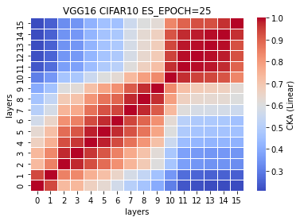   

CKA (RBF) plot:<br>
  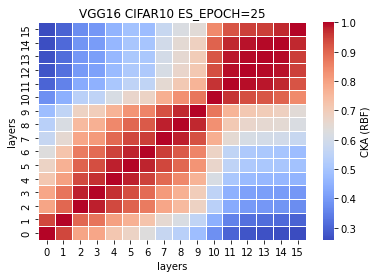  

## CKA layer removal VGG16
### remove ~10% params or 4 conv layers
5 exps: [0.7314, 0.7350, 0.7105, 0.7353, 0.7189] mean±std = (0.7262,0.0099)
```
Total params: 29,939,392
Trainable params: 29,939,392
Non-trainable params: 0
----------------------------------------------------------------
Input size (MB): 0.01
Forward/backward pass size (MB): 1.61
Params size (MB): 114.21
Estimated Total Size (MB): 115.83
----------------------------------------------------------------
-data_type=cifar10 -model_type=vgg16_N -learning_rate=0.001 -momentum=0.9 -num_epoch=50 -patience=50
```
VGG16_N model (VGG12)<br>
%reduced params = (33638218-29939392)/33638218\*100 = 10.9959%<br>
num. of reduced params = 33638218-29939392 = 3698826
```
def forward(self, x):
        
        x1 = self.conv1(x)
        
        x2 = F.relu(x1)
        x3 = self.conv2(x2)
        
        x4 = F.relu(x3)
        x5 = F.max_pool2d(x4, kernel_size=2, stride=2)
        x6 = self.conv3(x5)
        
        #x7 = F.relu(x6)
        #x8 = self.conv4(x7)
        
        x9 = F.relu(x6)
        x10 = F.max_pool2d(x9, kernel_size=2, stride=2)
        x11 = self.conv5(x10)
        
        #x12 = F.relu(x11)
        #x13 = self.conv6(x12)
        
        #x14 = F.relu(x13)
        #x15 = self.conv7(x14)
        
        x16 = F.relu(x11)
        x17 = F.max_pool2d(x16, kernel_size=2, stride=2)
        x18 = self.conv8(x17)
        
        #x19 = F.relu(x18)
        #x20 = self.conv9(x19)
        
        x21 = F.relu(x18)
        x22 = self.conv10(x21)
        
        x23 = F.relu(x22)
        x24 = F.max_pool2d(x23, kernel_size=2, stride=2)
        x25 = self.conv11(x24)
        
        x26 = F.relu(x25)
        x27 = self.conv12(x26)
        
        x28 = F.relu(x27)
        x29 = self.conv13(x28)
        
        x30 = F.relu(x29)
        x31 = F.max_pool2d(x30, kernel_size=2, stride=2)
        x32 = torch.reshape(torch.flatten(x31), (-1, 512))
        x33 = self.fc1(x32)
        
        x34 = F.relu(x33)
        x35 = self.fc2(x34)
        
        x36 = F.relu(x35)
        x37 = self.fc3(x36)
        
        x38 = F.log_softmax(x37, dim=1)
        
        feature_map = [x1, x3, x6, x11, x18, x22, x25, x27, x29, x33, x35, x37]
        
        return (feature_map, x38)
    # total params: 29,939,392
```
train_model2_x
```
2_1
Train loss: 0.840259, Valid loss: 0.978522
Updating model file...
Early stopping at: Epoch 13

2_2
Train loss: 0.601131, Valid loss: 0.943132
Updating model file...
Early stopping at: 16

2_3
Train loss: 0.615519, Valid loss: 0.964807
Updating model file...
Early stopping at: 16
----------------------------------------------
2_4
Train loss: 0.593968, Valid loss: 0.939733
Updating model file...
Early stopping at: 16
----------------------------------------------
2_5
Train loss: 0.494378, Valid loss: 0.967905
Updating model file...
Early stopping at: 17
```
features2_x.pt
```
2_1
Test average loss: 2.4430, acc: 0.7314
2_2
Test average loss: 2.3425, acc: 0.7350
----------
2_3
Test average loss: 2.0945, acc: 0.7105
----------
2_4
Test average loss: 2.3861, acc: 0.7353
----------
2_5
Test average loss: 2.4244, acc: 0.7189
----------
```
CKA (Linear) plot:<br>
   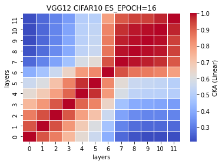 

CKA (RBF) plot:<br>
    

### remove ~18% or 5 conv layers (VGG11)
5 exps: [0.7353, 0.7321, 0.7228, 0.7197, 0.7357] mean±std = (0.7291, 0.0066)
```
Total params: 27,580,096
Trainable params: 27,580,096
Non-trainable params: 0
----------------------------------------------------------------
Input size (MB): 0.01
Forward/backward pass size (MB): 1.59
Params size (MB): 105.21
Estimated Total Size (MB): 106.82
----------------------------------------------------------------
-mode=train -model_type=vgg16_N -data_type=cifar10 -learning_rate=0.001 -momentum=0.9 -num_epoch=50 -patience=50
```
VGG16_N model (VGG11) <br>
%reduced params = (33638218-27580096)/33638218\*100 = 18.0096%<br>
num. of reduced params = 33638218-27580096 = 6058122
```
def forward(self, x):
        
        x1 = self.conv1(x)
        
        x2 = F.relu(x1)
        x3 = self.conv2(x2)
        
        x4 = F.relu(x3)
        x5 = F.max_pool2d(x4, kernel_size=2, stride=2)
        x6 = self.conv3(x5)
        
        #x7 = F.relu(x6)
        #x8 = self.conv4(x7)
        
        x9 = F.relu(x6)
        x10 = F.max_pool2d(x9, kernel_size=2, stride=2)
        x11 = self.conv5(x10)
        
        #x12 = F.relu(x11)
        #x13 = self.conv6(x12)
        
        #x14 = F.relu(x13)
        #x15 = self.conv7(x14)
        
        x16 = F.relu(x11)
        x17 = F.max_pool2d(x16, kernel_size=2, stride=2)
        x18 = self.conv8(x17)
        
        #x19 = F.relu(x18)
        #x20 = self.conv9(x19)
        
        x21 = F.relu(x18)
        x22 = self.conv10(x21)
        
        x23 = F.relu(x22)
        x24 = F.max_pool2d(x23, kernel_size=2, stride=2)
        x25 = self.conv11(x24)
        
        x26 = F.relu(x25)
        x27 = self.conv12(x26)
        
        #x28 = F.relu(x27)
        #x29 = self.conv13(x28)
        
        x30 = F.relu(x27)
        x31 = F.max_pool2d(x30, kernel_size=2, stride=2)
        x32 = torch.reshape(torch.flatten(x31), (-1, 512))
        x33 = self.fc1(x32)
        
        x34 = F.relu(x33)
        x35 = self.fc2(x34)
        
        x36 = F.relu(x35)
        x37 = self.fc3(x36)
        
        x38 = F.log_softmax(x37, dim=1)
        
        feature_map = [x1, x3, x6, x11, x18, x22, x25, x27, x33, x35, x37]
        
        return (feature_map, x38)
    # total params: 27,580,096
```
train_model3_x
```
3_1
Train loss: 0.606346, Valid loss: 0.950074
Updating model file...
Early stopping at: 14

3_2
Train loss: 0.719542, Valid loss: 0.891522
Updating model file...
Early stopping at: 13
----------------------------------------------
3_3
Train loss: 0.699429, Valid loss: 0.932371
Updating model file...
Early stopping at: 13
----------------------------------------------
3_4
Train loss: 0.632378, Valid loss: 0.927835
Updating model file...
Early stopping at: 14
----------------------------------------------
3_5
Train loss: 0.715451, Valid loss: 0.886982
Updating model file...
Early stopping at: 13
----------------------------------------------
```
features3_x.pt
```
3_1
Test average loss: 2.2414, acc: 0.7353

3_2
Test average loss: 2.4621, acc: 0.7321
----------

3_3
Test average loss: 2.1219, acc: 0.7228
----------

3_4
Test average loss: 2.2657, acc: 0.7197
----------
3_5
Test average loss: 2.2702, acc: 0.7357
----------
```
CKA (Linear) plot:<br>
    

CKA (RBF) plot:<br>
    

### remove ~18% params or 6 layers (VGG10)
5 exps: [0.7454, 0.7561, 0.7445, 0.7444, 0.7374] mean±std = (0.7456, 0.0060)
```
Total params: 27,539,136
Trainable params: 27,539,136
Non-trainable params: 0
----------------------------------------------------------------
Input size (MB): 0.01
Forward/backward pass size (MB): 1.59
Params size (MB): 105.05
Estimated Total Size (MB): 106.66
----------------------------------------------------------------
-mode=train -model_type=vgg16_N -data_type=cifar10 -learning_rate=0.001 -momentum=0.9 -num_epoch=50 -patience=50
```
VGG16_N model (VGG10) <br>
%reduced params = (33638218-27539136)/33638218\*100 = 18.1314%<br>
num. of reduced params = 33638218-27539136 = 6099082
```
def forward(self, x):
        
        x1 = self.conv1(x)
        
        x2 = F.relu(x1)
        x3 = self.conv2(x2)
        
        x4 = F.relu(x3)
        x5 = F.max_pool2d(x4, kernel_size=2, stride=2)
        x6 = self.conv3(x5)
        
        #x7 = F.relu(x6)
        #x8 = self.conv4(x7)
        
        x9 = F.relu(x6)
        x10 = F.max_pool2d(x9, kernel_size=2, stride=2)
        x11 = self.conv5(x10)
        
        #x12 = F.relu(x11)
        #x13 = self.conv6(x12)
        
        #x14 = F.relu(x13)
        #x15 = self.conv7(x14)
        
        x16 = F.relu(x11)
        x17 = F.max_pool2d(x16, kernel_size=2, stride=2)
        x18 = self.conv8(x17)
        
        #x19 = F.relu(x18)
        #x20 = self.conv9(x19)
        
        x21 = F.relu(x18)
        x22 = self.conv10(x21)
        
        x23 = F.relu(x22)
        x24 = F.max_pool2d(x23, kernel_size=2, stride=2)
        x25 = self.conv11(x24)
        
        x26 = F.relu(x25)
        x27 = self.conv12(x26)
        
        #x28 = F.relu(x27)
        #x29 = self.conv13(x28)
        
        x30 = F.relu(x27)
        x31 = F.max_pool2d(x30, kernel_size=2, stride=2)
        x32 = torch.reshape(torch.flatten(x31), (-1, 512))
        x33 = self.fc1(x32)
        
        x34 = F.relu(x33)
        x35 = self.fc2(x34)
        
        #x36 = F.relu(x35)
        #x37 = self.fc3(x36)
        
        x38 = F.log_softmax(x35, dim=1)
        
        feature_map = [x1, x3, x6, x11, x18, x22, x25, x27, x33, x35]
        
        return (feature_map, x38)
    # total params: 27,539,136
```
train_model4_x
```
4_1
Train loss: 0.718790, Valid loss: 0.881342
Updating model file...
Early stopping at: 13

4_2
Train loss: 0.674869, Valid loss: 0.852468
Updating model file...
Early stopping at: 14
----------------------------------------------
4_3
Train loss: 0.585402, Valid loss: 0.885301
Updating model file...
Early stopping at: 15
----------------------------------------------
4_4
Train loss: 0.540360, Valid loss: 0.908679
Updating model file...
Early stopping at: 15
----------------------------------------------
4_5
Train loss: 0.640493, Valid loss: 0.906032
Updating model file...
Early stopping at: 14
----------------------------------------------
```
features4_x.pt
```
4_1
Test average loss: 2.2320, acc: 0.7454

4_2
Test average loss: 2.1772, acc: 0.7561
----------
4_3
Test average loss: 2.2484, acc: 0.7445
----------
4_4
Test average loss: 2.2425, acc: 0.7444
----------
4_5
Test average loss: 2.1341, acc: 0.7374
----------
```
CKA (Linear) plot:<br>
    

CKA (RBF) plot:<br>
    

### remove ~18% params or 7 layers (VGG9)
5 exps: [0.7561, 0.7125, 0.7392, 0.7323, 0.7262] mean±std = (0.7333, 0.0144)
```
Total params: 27,502,272
Trainable params: 27,502,272
Non-trainable params: 0
----------------------------------------------------------------
Input size (MB): 0.01
Forward/backward pass size (MB): 1.09
Params size (MB): 104.91
Estimated Total Size (MB): 106.02
----------------------------------------------------------------
```
%reduced params = (33638218-27502272)/33638218\*100 = 18.2410% <br>
num. of reduced params = 33638218-27502272 = 6135946
```
def forward(self, x):
        
        x1 = self.conv1(x)
        
        #x2 = F.relu(x1)
        #x3 = self.conv2(x2)
        
        x4 = F.relu(x1)
        x5 = F.max_pool2d(x4, kernel_size=2, stride=2)
        x6 = self.conv3(x5)
        
        #x7 = F.relu(x6)
        #x8 = self.conv4(x7)
        
        x9 = F.relu(x6)
        x10 = F.max_pool2d(x9, kernel_size=2, stride=2)
        x11 = self.conv5(x10)
        
        #x12 = F.relu(x11)
        #x13 = self.conv6(x12)
        
        #x14 = F.relu(x13)
        #x15 = self.conv7(x14)
        
        x16 = F.relu(x11)
        x17 = F.max_pool2d(x16, kernel_size=2, stride=2)
        x18 = self.conv8(x17)
        
        #x19 = F.relu(x18)
        #x20 = self.conv9(x19)
        
        x21 = F.relu(x18)
        x22 = self.conv10(x21)
        
        x23 = F.relu(x22)
        x24 = F.max_pool2d(x23, kernel_size=2, stride=2)
        x25 = self.conv11(x24)
        
        x26 = F.relu(x25)
        x27 = self.conv12(x26)
        
        #x28 = F.relu(x27)
        #x29 = self.conv13(x28)
        
        x30 = F.relu(x27)
        x31 = F.max_pool2d(x30, kernel_size=2, stride=2)
        x32 = torch.reshape(torch.flatten(x31), (-1, 512))
        x33 = self.fc1(x32)
        
        x34 = F.relu(x33)
        x35 = self.fc2(x34)
        
        #x36 = F.relu(x35)
        #x37 = self.fc3(x36)
        
        x38 = F.log_softmax(x35, dim=1)
        
        feature_map = [x1, x6, x11, x18, x22, x25, x27, x33, x35]
        
        return (feature_map, x38)
    # total params: 27,502,272
```
train_model5_x
```
5_1
Train loss: 0.584666, Valid loss: 0.830359
Updating model file...
Early stopping at: 16

5_2
Train loss: 0.529756, Valid loss: 0.844136
Updating model file...
Early stopping at: 16
----------------------------------------------
5_3
Train loss: 0.689438, Valid loss: 0.869324
Updating model file...
Early stopping at: 14
----------------------------------------------
5_4
Train loss: 0.566496, Valid loss: 0.820620
Updating model file...
Early stopping at: 16
----------------------------------------------
5_5
Train loss: 0.640914, Valid loss: 0.832715
Updating model file...
Early stopping at: 14
----------------------------------------------
```
features5_x.pt
```
5_1
Test average loss: 2.0481, acc: 0.7561

5_2
Test average loss: 1.2710, acc: 0.7125
----------
5_3
Test average loss: 0.9462, acc: 0.7392
----------
5_4
Test average loss: 0.9763, acc: 0.7323
----------
5_5
Test average loss: 0.9981, acc: 0.7262
----------
```
CKA (Linear) plot:<br>
    

CKA (RBF) plot:<br>
  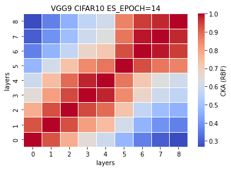  

### remove ~25% or 8 layers (VGG8)
5 exps: [0.7421, 0.7161, 0.7034, 0.7281, 0.7191] mean±std = (0.7218, 0.0129)
```
Total params: 25,142,976
Trainable params: 25,142,976
Non-trainable params: 0
----------------------------------------------------------------
Input size (MB): 0.01
Forward/backward pass size (MB): 1.03
Params size (MB): 95.91
Estimated Total Size (MB): 96.96
----------------------------------------------------------------
```
%reduced params = (33638218-25142976)/33638218\*100 = 25.2547% <br>
num. of reduced params = 33638218-25142976 = 8495242
```
def forward(self, x):
        
        x1 = self.conv1(x)
        
        #x2 = F.relu(x1)
        #x3 = self.conv2(x2)
        
        x4 = F.relu(x1)
        x5 = F.max_pool2d(x4, kernel_size=2, stride=2)
        x6 = self.conv3(x5)
        
        #x7 = F.relu(x6)
        #x8 = self.conv4(x7)
        
        x9 = F.relu(x6)
        x10 = F.max_pool2d(x9, kernel_size=2, stride=2)
        x11 = self.conv5(x10)
        
        #x12 = F.relu(x11)
        #x13 = self.conv6(x12)
        
        #x14 = F.relu(x13)
        #x15 = self.conv7(x14)
        
        x16 = F.relu(x11)
        x17 = F.max_pool2d(x16, kernel_size=2, stride=2)
        x18 = self.conv8(x17)
        
        #x19 = F.relu(x18)
        #x20 = self.conv9(x19)
        
        #x21 = F.relu(x18)
        #x22 = self.conv10(x21)
        
        x23 = F.relu(x18)
        x24 = F.max_pool2d(x23, kernel_size=2, stride=2)
        x25 = self.conv11(x24)
        
        x26 = F.relu(x25)
        x27 = self.conv12(x26)
        
        #x28 = F.relu(x27)
        #x29 = self.conv13(x28)
        
        x30 = F.relu(x27)
        x31 = F.max_pool2d(x30, kernel_size=2, stride=2)
        x32 = torch.reshape(torch.flatten(x31), (-1, 512))
        x33 = self.fc1(x32)
        
        x34 = F.relu(x33)
        x35 = self.fc2(x34)
        
        #x36 = F.relu(x35)
        #x37 = self.fc3(x36)
        
        x38 = F.log_softmax(x35, dim=1)
        
        feature_map = [x1, x6, x11, x18, x25, x27, x33, x35]
        
        return (feature_map, x38)
    # total params: 25,142,976
```
train_model6_x
```
6_1
Train loss: 0.660711, Valid loss: 0.851595
Updating model file...
Early stopping at: 14

6_2
Train loss: 0.602200, Valid loss: 0.863321
Updating model file...
Early stopping at: 15
----------------------------------------------
6_3
Train loss: 0.687117, Valid loss: 0.874917
Updating model file...
Early stopping at: 14
----------------------------------------------
6_4
Train loss: 0.715518, Valid loss: 0.859828
Updating model file...
Early stopping at: 13
----------------------------------------------
6_5
Train loss: 0.567657, Valid loss: 0.848754
Updating model file...
Early stopping at: 16
----------------------------------------------
```
features6_x.py
```
6_1
Test average loss: 2.1356, acc: 0.7421

6_2
Test average loss: 1.0195, acc: 0.7161
----------
6_3
Test average loss: 1.0824, acc: 0.7034
----------
6_4
Test average loss: 0.9548, acc: 0.7281
----------
6_5
Test average loss: 0.9945, acc: 0.7191
----------
```
CKA (Linear) plot:<br>
    

CKA (RBF) plot:<br>
    

### remove ~32% or 9 layers (VGG7)
[0.7422, 0.7183, 0.7112, 0.7285, 0.7141] mean±std = (0.7229, 0.0113)
```
Total params: 22,783,680
Trainable params: 22,783,680
Non-trainable params: 0
----------------------------------------------------------------
Input size (MB): 0.01
Forward/backward pass size (MB): 1.02
Params size (MB): 86.91
Estimated Total Size (MB): 87.94
----------------------------------------------------------------
```
%reduced params = (33638218-22783680)/33638218\*100 = 32.2685% <br>
num. of reduced params = 33638218-22783680 = 10854538
```
def forward(self, x):
        
        x1 = self.conv1(x)
        
        #x2 = F.relu(x1)
        #x3 = self.conv2(x2)
        
        x4 = F.relu(x1)
        x5 = F.max_pool2d(x4, kernel_size=2, stride=2)
        x6 = self.conv3(x5)
        
        #x7 = F.relu(x6)
        #x8 = self.conv4(x7)
        
        x9 = F.relu(x6)
        x10 = F.max_pool2d(x9, kernel_size=2, stride=2)
        x11 = self.conv5(x10)
        
        #x12 = F.relu(x11)
        #x13 = self.conv6(x12)
        
        #x14 = F.relu(x13)
        #x15 = self.conv7(x14)
        
        x16 = F.relu(x11)
        x17 = F.max_pool2d(x16, kernel_size=2, stride=2)
        x18 = self.conv8(x17)
        
        #x19 = F.relu(x18)
        #x20 = self.conv9(x19)
        
        #x21 = F.relu(x18)
        #x22 = self.conv10(x21)
        
        x23 = F.relu(x18)
        x24 = F.max_pool2d(x23, kernel_size=2, stride=2)
        x25 = self.conv11(x24)
        
        #x26 = F.relu(x25)
        #x27 = self.conv12(x26)
        
        #x28 = F.relu(x27)
        #x29 = self.conv13(x28)
        
        x30 = F.relu(x25)
        x31 = F.max_pool2d(x30, kernel_size=2, stride=2)
        x32 = torch.reshape(torch.flatten(x31), (-1, 512))
        x33 = self.fc1(x32)
        
        x34 = F.relu(x33)
        x35 = self.fc2(x34)
        
        #x36 = F.relu(x35)
        #x37 = self.fc3(x36)
        
        x38 = F.log_softmax(x35, dim=1)
        
        feature_map = [x1, x6, x11, x18, x25, x33, x35]
        
        return (feature_map, x38)
    # total params: 22,783,680
```
train_model7_x
```
7_1
Train loss: 0.522085, Valid loss: 0.880628
Updating model file...
Early stopping at: 15

7_2
Train loss: 0.555697, Valid loss: 0.842057
Updating model file...
Early stopping at: 15
----------------------------------------------
7_3
Train loss: 0.488027, Valid loss: 0.868555
Updating model file...
Early stopping at: 16
----------------------------------------------
7_4
Train loss: 0.398970, Valid loss: 0.861331
Updating model file...
Early stopping at: 17
----------------------------------------------
7_5
Train loss: 0.354991, Valid loss: 0.878753
Updating model file...
Early stopping at: 18
----------------------------------------------
```
features7_x.pt
```
7_1
Test average loss: 1.8591, acc: 0.7422

7_2
Test average loss: 1.0358, acc: 0.7183
----------
7_3
Test average loss: 1.0422, acc: 0.7112
----------
7_4
Test average loss: 1.0087, acc: 0.7285
----------
7_5
Test average loss: 1.0733, acc: 0.7141
----------
```
CKA (Linear) plot:<br>
   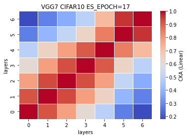 

CKA (RBF) plot:<br>
    

### remove ~82% or 10 layers (VGG6)
[0.7350, 0.7016, 0.7109, 0.7164, 0.7063] mean±std = (0.7140, 0.0116)
```
Total params: 6,006,464
Trainable params: 6,006,464
Non-trainable params: 0
----------------------------------------------------------------
Input size (MB): 0.01
Forward/backward pass size (MB): 0.98
Params size (MB): 22.91
Estimated Total Size (MB): 23.91
----------------------------------------------------------------
```
%reduced params = (33638218-6006464)/33638218\*100 = 82.1439% <br>
num. of reduced params = 33638218-6006464 = 27631754
```
def forward(self, x):
        
        x1 = self.conv1(x)
        
        #x2 = F.relu(x1)
        #x3 = self.conv2(x2)
        
        x4 = F.relu(x1)
        x5 = F.max_pool2d(x4, kernel_size=2, stride=2)
        x6 = self.conv3(x5)
        
        #x7 = F.relu(x6)
        #x8 = self.conv4(x7)
        
        x9 = F.relu(x6)
        x10 = F.max_pool2d(x9, kernel_size=2, stride=2)
        x11 = self.conv5(x10)
        
        #x12 = F.relu(x11)
        #x13 = self.conv6(x12)
        
        #x14 = F.relu(x13)
        #x15 = self.conv7(x14)
        
        x16 = F.relu(x11)
        x17 = F.max_pool2d(x16, kernel_size=2, stride=2)
        x18 = self.conv8(x17)
        
        #x19 = F.relu(x18)
        #x20 = self.conv9(x19)
        
        #x21 = F.relu(x18)
        #x22 = self.conv10(x21)
        
        x23 = F.relu(x18)
        x24 = F.max_pool2d(x23, kernel_size=2, stride=2)
        x25 = self.conv11(x24)
        
        #x26 = F.relu(x25)
        #x27 = self.conv12(x26)
        
        #x28 = F.relu(x27)
        #x29 = self.conv13(x28)
        
        x30 = F.relu(x25)
        x31 = F.max_pool2d(x30, kernel_size=2, stride=2)
        x32 = torch.reshape(torch.flatten(x31), (-1, 512))
        x33 = self.fc1(x32)
        
        #x34 = F.relu(x33)
        #x35 = self.fc2(x34)
        
        #x36 = F.relu(x35)
        #x37 = self.fc3(x36)
        
        x38 = F.log_softmax(x33, dim=1)
        
        feature_map = [x1, x6, x11, x18, x25, x33]
        
        return (feature_map, x38)
    # total params: 6,006,464
```
train_model8_x
```
8_1
Train loss: 0.398895, Valid loss: 0.858886
Updating model file...
Early stopping at: 18

8_2
Train loss: 0.420581, Valid loss: 0.861237
Updating model file...
Early stopping at: 18
----------------------------------------------
8_3
Train loss: 0.539408, Valid loss: 0.863718
Updating model file...
Early stopping at: 16
----------------------------------------------
8_4
Train loss: 0.429075, Valid loss: 0.893893
Updating model file...
Early stopping at: 18
----------------------------------------------
8_5
Train loss: 0.532771, Valid loss: 0.851450
Updating model file...
Early stopping at: 16
----------------------------------------------
```
features8_x.pt
```
8_1
Test average loss: 1.8300, acc: 0.7350

8_2
Test average loss: 0.9925, acc: 0.7016
----------
8_3
Test average loss: 0.9710, acc: 0.7109
----------
8_4
Test average loss: 0.9749, acc: 0.7164
----------
8_5
Test average loss: 0.9998, acc: 0.7063
----------
```
CKA (Linear) plot:<br>
    

CKA (RBF) plot:<br>
    


### reaching the limit: remove 89% or 11 layers (VGG5)
[0.7319, 0.7204, 0.7176, 0.7198, 0.7166] mean±std = (0.7213, 0.0055)
```
Total params: 3,647,168
Trainable params: 3,647,168
Non-trainable params: 0
----------------------------------------------------------------
Input size (MB): 0.01
Forward/backward pass size (MB): 0.97
Params size (MB): 13.91
Estimated Total Size (MB): 14.89
----------------------------------------------------------------
```
%reduced params = (33638218-3647168)/33638218\*100 = 89.1577% <br>
num. of reduced params = 33638218-3647168 = 29991050
```
        #self.fc1 = nn.Linear(512, 4096, bias=False)
        self.fc1 = nn.Linear(512*2*2, 4096, bias=False)
        self.fc2 = nn.Linear(4096, 4096, bias=False)
        self.fc3 = nn.Linear(4096, 10, bias=False)
        
        
    def forward(self, x):
        
        x1 = self.conv1(x)
        
        #x2 = F.relu(x1)
        #x3 = self.conv2(x2)
        
        x4 = F.relu(x1)
        x5 = F.max_pool2d(x4, kernel_size=2, stride=2)
        x6 = self.conv3(x5)
        
        #x7 = F.relu(x6)
        #x8 = self.conv4(x7)
        
        x9 = F.relu(x6)
        x10 = F.max_pool2d(x9, kernel_size=2, stride=2)
        x11 = self.conv5(x10)
        
        #x12 = F.relu(x11)
        #x13 = self.conv6(x12)
        
        #x14 = F.relu(x13)
        #x15 = self.conv7(x14)
        
        x16 = F.relu(x11)
        x17 = F.max_pool2d(x16, kernel_size=2, stride=2)
        x18 = self.conv8(x17)
        
        #x19 = F.relu(x18)
        #x20 = self.conv9(x19)
        
        #x21 = F.relu(x18)
        #x22 = self.conv10(x21)
        
        #x23 = F.relu(x18)
        #x24 = F.max_pool2d(x23, kernel_size=2, stride=2)
        #x25 = self.conv11(x24)
        
        #x26 = F.relu(x25)
        #x27 = self.conv12(x26)
        
        #x28 = F.relu(x27)
        #x29 = self.conv13(x28)
        
        x30 = F.relu(x18)
        x31 = F.max_pool2d(x30, kernel_size=2, stride=2)
        #print(x31.shape)
        x32 = x31.view(x31.size(0),-1)
        #x32 = torch.reshape(torch.flatten(x31), (-1, 512))
        #print(x32.shape)
        x33 = self.fc1(x32)
        
        #x34 = F.relu(x33)
        #x35 = self.fc2(x34)
        
        #x36 = F.relu(x35)
        #x37 = self.fc3(x36)
        
        x38 = F.log_softmax(x33, dim=1)
        
        feature_map = [x1, x6, x11, x18, x33]
        
        return (feature_map, x38)
    # total params: 3,647,168
```
train_model9_x
```
9_1
Train loss: 0.583674, Valid loss: 0.839788
Updating model file...
Early stopping at: 14

9_2
Train loss: 0.578305, Valid loss: 0.871138
Updating model file...
Early stopping at: 14
----------------------------------------------
9_3
Train loss: 0.608685, Valid loss: 0.863399
Updating model file...
Early stopping at: 13
----------------------------------------------
9_4
Train loss: 0.638563, Valid loss: 0.856784
Updating model file...
Early stopping at: 13
----------------------------------------------
9_5
Train loss: 0.521172, Valid loss: 0.846765
Updating model file...
Early stopping at: 15
----------------------------------------------
```
features9_x.pt
```
9_1
Test average loss: 1.6781, acc: 0.7319

9_2
Test average loss: 0.9899, acc: 0.7204
----------
9_3
Test average loss: 0.9833, acc: 0.7176
----------
9_4
Test average loss: 0.9790, acc: 0.7198
----------
9_5
Test average loss: 1.0242, acc: 0.7166
----------
```
CKA (Linear) plot:<br>
 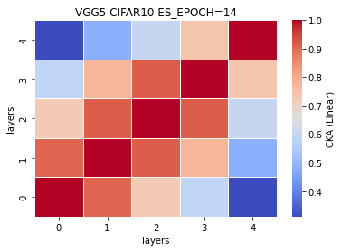 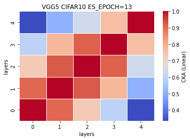 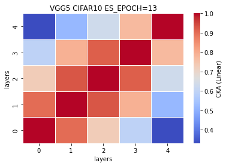 

CKA (RBF) plot:<br>
 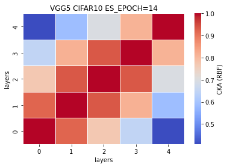   

### Ablation 1: remove ~20% params or 10 layers but conv not fc
The removal in this ablation study is not based on the observation of CKA similarity plot, and in fact, we remove the conv layer purely because it is a removable layer, and the architecture will not change even if we remove it. We keep the second fc layer although it is more similar to the adjacent fc layer. <br>
5 exps: [] (mean,std) = ()
```
----------------------------------------------------------------
        Layer (type)               Output Shape         Param #
================================================================
            Conv2d-1           [-1, 64, 32, 32]           1,728
            Conv2d-2          [-1, 128, 16, 16]          73,728
            Conv2d-3            [-1, 256, 8, 8]         294,912
            Conv2d-4            [-1, 512, 4, 4]       1,179,648
            Linear-5                 [-1, 4096]       8,388,608
            Linear-6                 [-1, 4096]      16,777,216
================================================================
Total params: 26,715,840
Trainable params: 26,715,840
Non-trainable params: 0
----------------------------------------------------------------
Input size (MB): 0.01
Forward/backward pass size (MB): 1.00
Params size (MB): 101.91
Estimated Total Size (MB): 102.92
----------------------------------------------------------------
```
%reduced params = (33638218-26715840)/33638218\*100 = 20.5789% <br>
num. of reduced params = 33638218-26715840 = 6922378
```
        #self.fc1 = nn.Linear(512, 4096, bias=False)
        self.fc1 = nn.Linear(512*2*2, 4096, bias=False)
        self.fc2 = nn.Linear(4096, 4096, bias=False)
        self.fc3 = nn.Linear(4096, 10, bias=False)
        
        
    def forward(self, x):
        
        x1 = self.conv1(x)
        
        #x2 = F.relu(x1)
        #x3 = self.conv2(x2)
        
        x4 = F.relu(x1)
        x5 = F.max_pool2d(x4, kernel_size=2, stride=2)
        x6 = self.conv3(x5)
        
        #x7 = F.relu(x6)
        #x8 = self.conv4(x7)
        
        x9 = F.relu(x6)
        x10 = F.max_pool2d(x9, kernel_size=2, stride=2)
        x11 = self.conv5(x10)
        
        #x12 = F.relu(x11)
        #x13 = self.conv6(x12)
        
        #x14 = F.relu(x13)
        #x15 = self.conv7(x14)
        
        x16 = F.relu(x11)
        x17 = F.max_pool2d(x16, kernel_size=2, stride=2)
        x18 = self.conv8(x17)
        
        #x19 = F.relu(x18)
        #x20 = self.conv9(x19)
        
        #x21 = F.relu(x18)
        #x22 = self.conv10(x21)
        
        #x23 = F.relu(x18)
        #x24 = F.max_pool2d(x23, kernel_size=2, stride=2)
        #x25 = self.conv11(x24)
        
        #x26 = F.relu(x25)
        #x27 = self.conv12(x26)
        
        #x28 = F.relu(x27)
        #x29 = self.conv13(x28)
        
        x30 = F.relu(x18)
        x31 = F.max_pool2d(x30, kernel_size=2, stride=2)
        #print(x31.shape)
        #x32 = torch.reshape(torch.flatten(x31), (-1, 512))
        x32 = x31.view(x31.size(0),-1)
        #print(x32.shape)
        x33 = self.fc1(x32)
        
        x34 = F.relu(x33)
        x35 = self.fc2(x34)
        
        #x36 = F.relu(x35)
        #x37 = self.fc3(x36)
        
        x38 = F.log_softmax(x35, dim=1)
        
        feature_map = [x1, x6, x11, x18, x33, x35]
        
        return (feature_map, x38)
```
train_model10_x
```
10_1

10_2

10_3

10_4

10_5

```
features10_x.pt
```
10_1

10_2

10_3

10_4

10_5

```
CKA (Linear) plot:<br>
 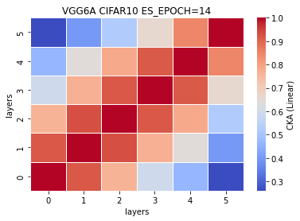   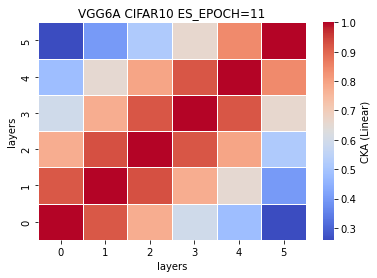

CKA (RBF) plot:<br>
    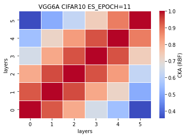
