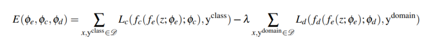
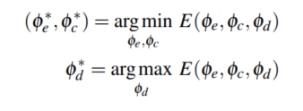
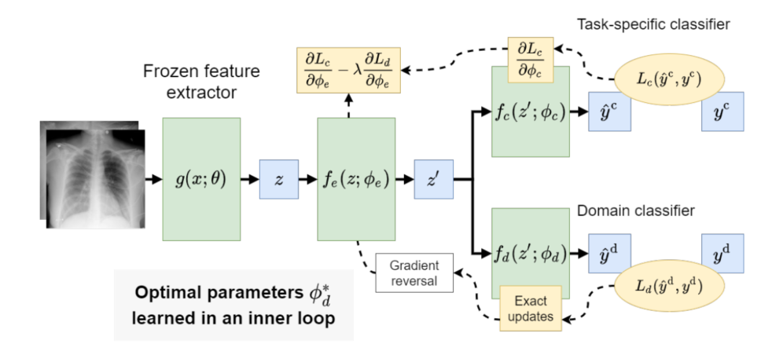
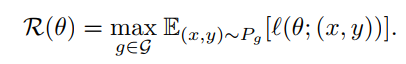
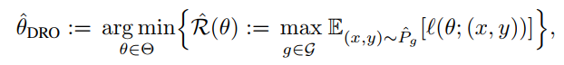

# content
shortcut learning
- [2-stage LCN-HCN](https://github.com/YHJYH/Machine_Learning/blob/main/projects/Master_Thesis/papers.md#2-stage-lcn-hcn)
- [feature disentanglement](https://github.com/YHJYH/Machine_Learning/blob/main/projects/Master_Thesis/papers.md#feature-disentanglement-in-covid-19-cxr-image-classification)
- [data imbalance](https://github.com/YHJYH/Machine_Learning/blob/main/projects/Master_Thesis/papers.md#data-imbalance)
- [group worst-case loss](https://github.com/YHJYH/Machine_Learning/blob/main/projects/Master_Thesis/papers.md#group-worst-case-loss)
- [just train twice](https://github.com/YHJYH/Machine_Learning/blob/main/projects/Master_Thesis/papers.md#just-train-twice)

text summarization
- [PlanSum](https://github.com/YHJYH/Machine_Learning/blob/main/projects/Master_Thesis/papers.md#plansum)

## 2-stage LCN-HCN
title: A Too-Good-to-be-True Prior to Reduce Shortcut Reliance

author: Nikolay Dagaev, Bradley C. Love

year: 2021

dataset: CIFAR-10

summary: 介绍了用Low-capacity networks(LCN)来检测shortcuts，然后在high-capacity networks的训练过程中 将检测到的shortcuts downweights。 
介绍了local和global两种shortcuts的类型。前者是图片上固定位置的色块记号；后者类似于整张图片覆盖的Gaussian noise。 
local的又分为congruent和incongruent两种shortcuts，前者是training set和test set上同一label下的图片上的sc标记颜色位置相同，比如ship(red), plane(blue)；incongruent是同一label下的颜色不同，记住，同一个label下的颜色都是相同的，不同的是同一个label下training set和test set的颜色，比如 train: ship(red), plane(blue); test: ship(blue), plane(red).

question: how to downweights?

## feature disentanglement in COVID-19 CXR image classification
title: Deep learning models for COVID-19 chest x-ray classification: Preventing shortcut learning using feature disentanglement

author: Caleb Robinson, Juan M. Lavista Ferres
 
year: 2021

summary: 这篇文章借用了一种“feature 反纠缠”的方法，这种方法的特色是，我们提前知道shortcut feature是哪个了，我们通过最大化shortcut feature的loss来使其不被我们的networks care，即把shortcut feature从所有feature里disentangle出来。 
同时feature entanglement也是建立在transfer learning的基础上，即一部分参数是训练好然后fronzen的。 
具体来说主要分为两个parts, 第一：我们通过feature extractor g(x, \theta)=z (这一步类似于kernel)得到提取的feature z，但是这个z不直接参与estimator f(z, \phi)，而是再经过一个feature extractor f_e(z, \phi_{e})得到z'。再将这个z'喂给两个classifiers，一个classifier是用来classifyshortcut feature的（recall上面提过，sc我们已经提前知道是哪个了），另一个则是其他features。第二就是使用的loss function了，是一个min-max的过程（和GAN有点像？），如下所示。
 
 
网络结构如下所示：
 

question: 按照0028里学的，如果要彻底disentangle，那\phi_{d}不应该直接等于0吗，表示feature z'和domain label y^{d}没有correlation。 
参数更新文章里写的不是很清楚，但是可以大概看出来应该是fix一个，更新另一个这种iterative的模式。

## data imbalance
title: Simple data balancing achieves competitive worst-group-accuracy

author: Badr Youbi Idrissi, David Lopez-Paz
 
year: 2022

summary: 

question: 

## PlanSum
title: Unsupervised Opinion Summarization with Content Planning

author: Reinald Kim Amplayo, Stefanos Angelidis, Mirella Lapata

year: 2021

dataset: Rotten Tomatoes, Yelp, Amazon

summary:

## group worst-case loss
title: distributionally robust neural networks for group shifts: on the importance of regularization for worst-case generalization

author: Shiori Sagawa, Pang Wei Koh, Tatsunori B. Hashimoto, Percy Liang

year: 2020

dataset: WaterBirds, CelebA, MultiNLI

summary: worst group指的是训练过程中表现training accuracy最低的那一些数据集合成的group，这个group的acc低的原因是因为NN学习到了一些错误的相关性（correlation），比如在识别任务中过分关注于背景而非物体本身。 
一般group DRO和ERM方法在训练中出现的现象如下：
- test group的average acc很
- worst group的training acc很高
- worst group的test acc很低

这说明worst-group的generalization gap很大（第三条）,尽管on average generalization gap不大（第一条）。 
在本文中generalization gep的定义是expected error - empirical error (在同一dateset上，一般是test set)。 

本文使用的method是strongly-regularized group DRO, 包括三个部分的变化：
1. L2 penalty
2. early stopping
3. *gropu adjustment*: 这一点证明了regularization对于整体的avg performance不一定有帮助，但是对worst-group performance还是很有帮助的。

本文使用的方法本质上还是**DRO** (distributionally robust optimization): 找到参数可以minimize empirical worst-group risk， worst-group risk通过将数据分类成不同的groups s.t. maximize expected loss of each group来obtain。具体两个公式如下所示。 
worst-case risk (maximum over the expected loss of each group):
 
group DRO model (minimize the empirical worst-case risk):
 

Y(labels) = {Y1, Y2}, A(shortcut features) = {A1, A2}, # groups m = |Y|\*|A| = 4 
如果一组数据，label都是Y1，都有A1 feature，且training loss很低（表示学到了A1 和 Y1的correlation），那么model在{Y1, A2}上的表现就应该很差。这种{Y1, A2}, {Y2, A1}就是worst-group。

结果： 在maintain high avg acc的同时，本文通过上述方法很大程度提升了worst-group的acc。本文是建立在overparameterized NN上（即有很多参数，使training acc很高的同时也保证了generalize well on avg, but not on the worst-group）。

## just train twice
title: Just Train Twice: Improving Group Robustness without Training Group Information

author: Evan Zheran Liu, Behzad Haghgoo, Annie S. Chen, Aditi Raghunathan, Pang Wei Koh, Shiori Sagawa, Percy Liang, Chelsea Finn

year: 2021

dataaset: Waterbirds, CelebA, MultiNLI, CivilComments-WILDS

summary: JTT, two-stage approach.
- stage 1: upweight misclassified training examples (*worst-group*) at the end of a few steps of standard training;
- stage 2: minimize the loss over the reweighted dataset.

ERM的问题：整体的avg training loss降底但是certain group还是有high error；造成这种情况的原因：spurious correlation（shortcuts）。

previous的解决方法：training group annotations [Sagawa et al., 2020a](), 缺点：expensive。

JTT:  only requiring group annotations on a much smaller validation set to tune hyperparameters. 将misclassified examples直接当作worst-group examples。 
和JTT思想相似的一个方法是(DRO) that minimizes the conditional value at risk (CVaR)： *CVaR DRO*。但是JTT比CVaR DRO表现要好。两者的区别是JTT upweight的examples是固定的（static），CVaR DRO是动态upweight minibatch里的examples。

Q：
- misclassified examples确实是属于worst-group的examples但是不代表这些examples属于同一个group i.e. 有相同的shortcuts。
- static为什么就比dynamic要好呢？

## training group annotations
title:

author:

year: 2020

dataset:

summary:

