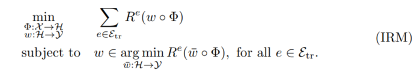
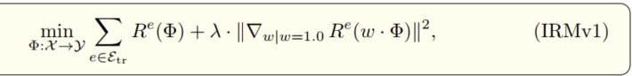

# Invariant Risk Minimization
- goal: learn correlations invariant(stable) across training environments.
- i.e. finding a data representation such that the optimal classifier, on top of that data representation, is the same for all environments. 
- IRM: a learning paradigm to estimate data representations eliciting invariant predictors $w \cdot \phi$ across multiple environments. ($\phi$ is the features) 

IRM mathematical representation:
  
Phrasing the constraints as a penalty:
  

- conclusion:
    - IRM estimates nonlinear, invariant, causal predictors from multiple training environments;
    - IRM enables o.o.d. generalization.

[back](https://github.com/YHJYH/Machine_Learning/blob/main/projects/Master_Thesis/papers/refs.md#content)
