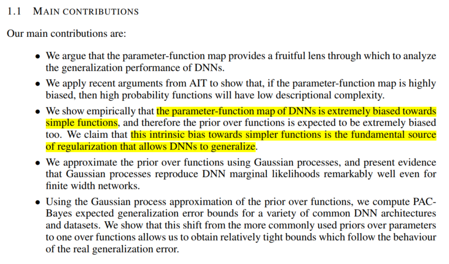

# DEEP LEARNING GENERALIZES BECAUSE THE PARAMETER-FUNCTION MAP IS BIASED TOWARDS SIMPLE FUNCTIONS
_why DNNs do not strongly overfit?_

Using probability-complexity bound recently derived from algorithmic information theory (AIT), we argue that the **parameter-function map of many DNNs should be exponentially biased towards simple functions**. 

### introduction
1. DNNs are typically **overparametrized**, with many more parameters than training examples.

> Classical learning theory suggests that overparametrized models lead to overfitting, and so poorer generalization performance. 

_Why do DNNs generalize at all, given that they are so highly expressive and overparametrized?_

2. stationary point of the loss function:  products of eigenvalues of the local Hessian matrix.

Flatter stationary points (often simply called minima) are associated with better generalization performance.

Intuition: flatter minima are associated with **simpler functions**, which should generalize better.

The generalization performance of a standard DNN correlates closely with a **robust measure of the flatness of the minima**.

_Why do solutions vary so much in flatness or associated properties such as basin volume?_

### main contributions

