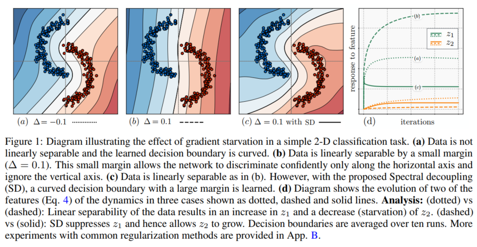

# Gradient Starvation: A Learning Proclivity in Neural Networks

- gradient descent tends to learn low-level superficial features first.
- **gradient starvation** causes *feature imbalance* in NN trained with crossentropy. (VGG16 on cifar10)

## contributions
- learning dynamics of linearized NN trained with cross-entropy loss.
- formalize gradient starvation (GS): coupling between the dynamics of orthogonal directions in the feature space.
- introduce spectral decoupling (SD): a regularizer, helps decouple learning dynamics, mitigate GS.

作者设计了一个简单实验，用来证明NN using GD trained with cross-entropy只学到最简单的feature，具体如下所示： 

作者进行了多次实验，得出结论：上述的NN学不到curved decision boundary。 
作者进行的实验如下：
- training longer;
- using different regularizers (weight decay, dropout, batch norm);
- using different optimization algorithms (SGD, Adam);
- changing NN architecture; (我正在进行的，基于CKA similarity改变NN architecture)
- changing coordinate system.

对此，作者认为原因是：
- loss function的问题（cross-entropy loss 导致GS）
- 当一个feature学得更快时（简单feature），包含简单feature的examples对于gradient的贡献会减少；
- 这就导致梯度信号减少，阻止了NN学习其他的features（更为复杂的features）。

这种现象会造成的结果有：
- 

[back](https://github.com/YHJYH/Machine_Learning/blob/main/projects/Master_Thesis/papers/111.md#content)
