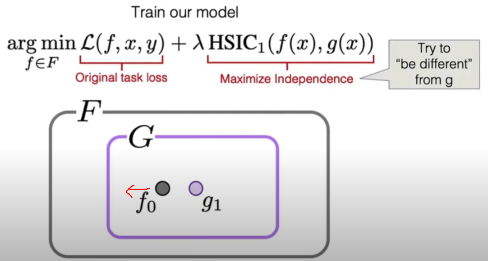

# Learning De-biased Representations with Biased Representations

Problem: we cannot know every bias feature exactly -> so we cannot build a totally unbiased dataset.

Method: 有点GAN的味道。 
1. 训练一个original task model（包含bias和non-bias features）;
2. intentionally train a set of biased models（只包含bias features）;
3. force the original model to learn a different representation;

Questions:
1. how to characterize bias with models (Method No.2).
2. how to encode "be different" (Mehod No.3).

Key points of answers:
1. a model can be intentionally biased towards texture by reducing the *receptive fields*

2. encode to be different through *statistical independence*: measure with **HSIC**
    - HSIC(U,V)=0 iff two representations U and V are independent;
    - "be different" = minimize HSIC

 
 

Proposed Method: ReBias 

 
 

Experiment results:  
ReBias effectively removes bias in Biased MNIST, ImageNet (-A and -C) classification, and action recognition.

[back](https://github.com/YHJYH/Machine_Learning/blob/main/projects/Master_Thesis/papers/refs.md#content)
