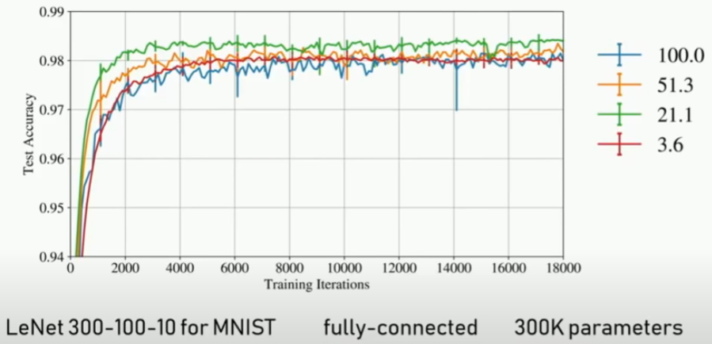
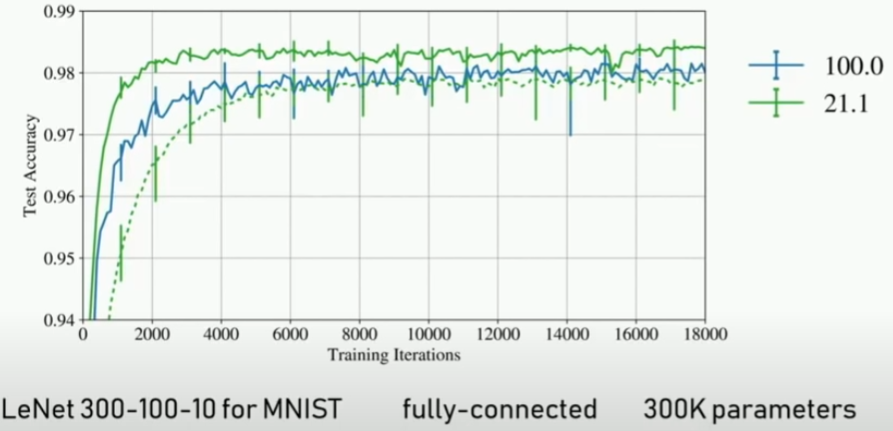
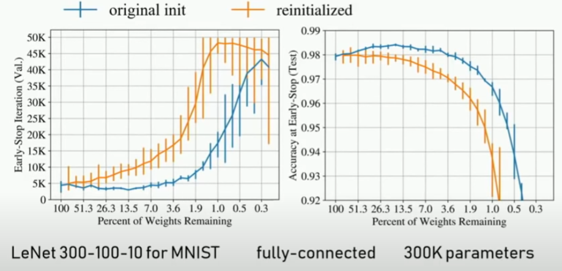
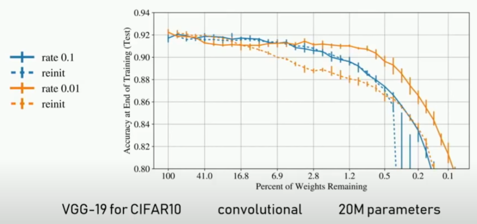

# The Lottery Ticket Hypothesis: Finding Sparse, Trainable Neural Networks

### BACKGROUND: network pruning
1. train the network
2. remove superfluous structure
    - structure: **weights**, neurons, filters, channels.
    - superfluous: **magnitudes**, gradients, activations.
3. fine-tune the network
4. optionally: repeat step 2 and 3 iteratively.
 

**known 1**: 训练一个pruned network from the beginning并不能达到完整network的accuracy。 

> Training a pruned model from scratch performs worse than retraining a pruned model, which may indicate the difficulty of training a network with small capacity. --"Pruning filters for efficient convnets"

> During retraining, it is better to retain the weights from the initial training phase for the connections that survived pruning than it is to reinitialize the pruned layers. --this paper
 

### EXPERIMENTS
_can we train (sparsely) pruned networks from scratch?_ 
Yes. 如果我们训练一个pruned network，使用完整的network的same initialization，就可以达到起码同样的accuracy。 
 

Training pruned networks:
1. randomly initialize the **full network**.
2. train it and prune superfluous structure.
3. reset each remaining weight to its value from 1 (before the full network is trained).
4. repeat step 2 and 3 iteratively.
 

Experiments:
- a fully-connected network for MNIST
- convolutional networks or CIFAR10
- Dropout, weight decay, batchnorm, resnets, some optimizer, etc.
 

**Note: if reinitialize, this does not work.**
 

Pruned networks (subnetworks):
- between 15% and 1% of the original size.
- learn faster than the original network.
- reach the same or higher test accuracy.
 

_do networks have to be so overparameterized to learn?_ (overparameterized: # parameters > # data points)
No.

### CAVEATS
- subnetworks are found retroactively.
- finding subnetworks is very expansive.
- so only focus on small, vision networks and tasks.

### RESULTS Part 1 (shallow networks)

- BLUE: maintain 100% weights;
- YELLOW: maintain 51.3% weights;
- GREEN: maintain 21.1% weights;
- RED: maintain 3.6% weights;
- network used: LeNet 300-100-10 for MNIST
- fully-connected
- # params: 300k
 

- dashed line: reinitialized;
- solid line: original initialization.
 

- Left: defined training speed 
    - y: 达到optimal validation accuracy所需的iteration次数(也就是early-stopping)
- Right: test accuracy under corresponding early-stopping
 

### RESULTS Part 2 (deep networks)

- BLUE: learning rate high (0.1)
    - reinitialization on subnetworks does not affect much.
- ORANGE: learning rate low (0.01)
    - reinitialization affects a lot on subnetworks.

[back](https://github.com/YHJYH/Machine_Learning/blob/main/projects/Master_Thesis/papers/refs.md#content)
