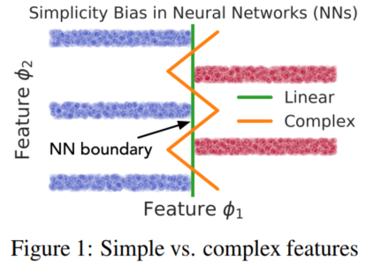

# The Pitfalls of Simplicity Bias in Neural Networks

linear-like simple classifier vs. nonlinear complex classifier. 
SB: simplicity bais. 
features:
- spurious features & low-level statistical patterns.
- semantic features & high-level abstractions.

## datasets
different coordinates/blocks define decision boundaries of varying complexity. 
- *feature*: each coordinate/block.
- *feature simplicity*: based on the simplicity of the corresponding decision boundary.

> Figure 1. A stylized version of the proposed synthetic dataset with two features, φ1 and φ2, that can perfectly predict the label with 100% accuracy, but differ in simplicity.

**modular synhexthetic dataset**:
- the simplicity of a feature is precisely determined by the minimum number of lienar pieces in the decision boundary that achieves optimal classification accuracy using that feature.
    - Fig.1. the simple feature φ1 requires a linear decision boundary to perfectly predict the label, whereas complex feature φ2 requires four linear pieces.

**image-based dataset**:
- each image concatenates MNIST images (simple feature) and CIFAR-10 images (complex feature).

observations:
1. the ideal decision boundary that achieves high accuracy and robustness relies on *all features to obtain a large margin*. 
    - the orange decision boundary in Figure 1 that learns φ1 and φ2 attains 100% accuracy and exhibits more robustness than the linear boundary because of larger margin. 
2. *extreme nature of SB*: neural networks simply ignore several complex predictive features in the presence of few simple predictive features.
    - open backdoor attacks against NNs.

3 major pitfalls of SB:
1. lack of robustness.
    - small margin: susceptibility to small adversarial perturbations.
    - simple features: supurious correlations.
2. lack of reliable confidence estimates.
    - high condidence: all predictive features agree in their prediction. 
    - the network has high confidence even if several complex predictive features contradict the simple feature.
3. suboptimal generalization.

## summary
2 contributions:
1. designed datasets: stratification of features based on simplicity and predictive power. 
2. evidence shows that NN exhibit extreme SB.
3. additionally: approaches to improve generalization and robustness (ensembles and adversarial training) do not help SB and its pitfalls.

SB: causes of
1. poor ood performance;
2. adversarial vulnerability;
3. suboptimal generalization.

## related works
**ood performance**:
- phenomenon: NN learns spurious features so poor ood performance.
- implication: open backdoor attacks to against NNs.
- improve methods: require *domain-specific knowledge* or *annotation artifacts*.
- this work: formalizing the notion of  the features and feature reliance (without domain knowledge).

**adversarial robustness**:
- phenomenon: NNs exhibit vulnerability to small adversarial perturbations.
- improve methods: adversarial training & ensembles. 
    - *local linearity of trained NNs*;
    - insufficient data;
    - inevitability in high dimensions;
    - computational barriers;
    - limitations of NN architectures;
    - *presence of non-robust features*;
    - *invariance to large label-relevant perturbations*;
    - *universal adversarial perturbations (UAPs)*, agnostic to model and data.
 
**implicit bias of SGD**:
- phenomenon: SGD-trained NNs generalize well because SGD learns models of increasing complexity.
- SGD 对线性分类器的非线性可分数据有implicit bias.
- this work: SGD’s implicit bias towards simplicity can result in small-margin and feature-impoverished classifiers instead of large-margin and feature-dense classifiers.

**feature reliance**:
- 

[back]()
