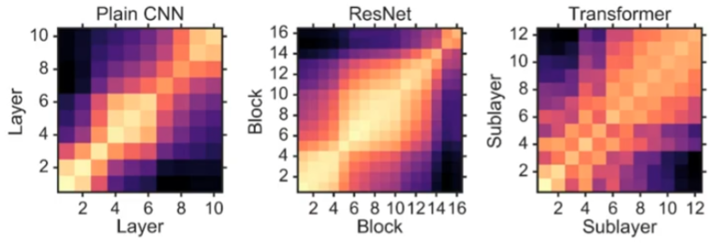
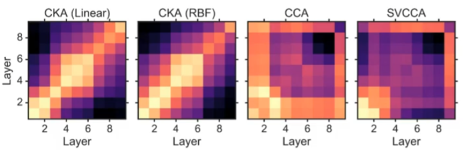
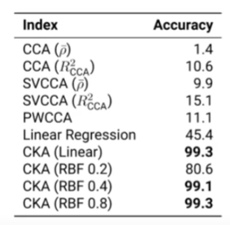
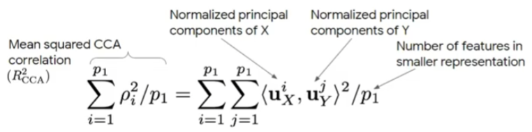
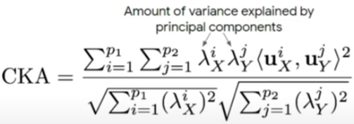
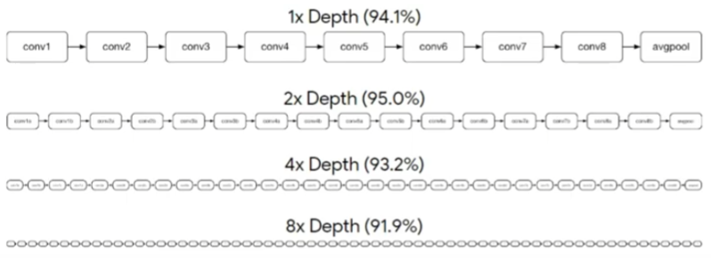
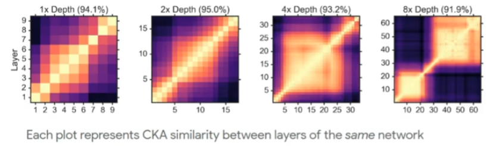

# Similarity of Neural Network Representations Revisited

Get to know the trained NN: by looking at and comparing their representaion.

- Centred kernel alignment (CKA):
    - **meaningful similarities**：can measure meaningful similarities between representations of higher dimension than the number of data points.
    - **different initializations**: can identify correspondences between representations in networks trained from different initializations. 
 
 

- **representation**: a $n \times m$ matrix.
    - centred: substract the mean across.
    - n: # examples, m: # features.
 
 

- Comparison between representations: X and Y
    - Note: two representations of different layer but must have $n_{X} = n_{Y}$. 
 
 

- Similarity
    - simple measurement: dot product (cosine) (linear kernel)
 
 

- Comparing representation by **comparing features**
    - $X^{T}Y$, a $m_{X} \times m_{Y}$ matrix.
    - dot product between column (features), so it is the similarity between features.
- Comparing representation by **comparing exmaples**
    - $XX^{T}$, a $n_{X} \times n_{X}$ matrix.
    - dot product between row (examples), so it is the similarity between examples.
    - **Gram matrix** (ML) or representational similarity matrix (neuroscience).
 
 

- back to *Comparison between representations: X and Y*: 
    - each representation X and Y has its own Gram matrix;
    - vectorize the Gram matrix: $vec(XX^{T})$ and $vec(YY^{T})$ of size $(n \times 1)$;
    - dot produc between two Gram vectors;
    - is equal to sum of squared dot products between features: $||X^{T}Y||^{2}\_{F} = \langle vec(XX^{T}, vec(YY^{T}))\rangle$;
    - so **comparing features = comparing examples**.
    - normalization. $\frac{||X^{T}Y||^{2}\_{F}}{||X^{T}X||\_{F}||Y{T}Y||\_{F}} = \frac{\langle vec(XX^{T}, vec(YY^{T}))\rangle}{||XX^{T}||\_{F}||YY^{T}||\_{F}}$
        - "F" stands for Frobenius norm/Euclidean norm/L2 norm.
 
 

- The kernel trick
    - $K_{ij} = k(x_{i},x_{j})$, $K = \langle x,x \rangle$
    - define *centering matrix* $H$, so $\tilde{K} = HKH$
    - so the Eq. becomes $\frac{\langle vec(\tilde{K}),vec(\tilde{L}) \rangle}{||\tilde{K}||\_{F}||\tilde{L}||\_{F}}$.
 
 

### Sanity check for similarity

- 两个*结构相同initialization不同*的NN A和B，A中的一个layer和B中对应的layer应该是**the most similar**的。

**CKA passes sanity checks across architectures**  

Compare to other approaches (other methods do not pass sanity check)  

Sanity checks in terms of accuracy  

- **CCA** Canonical correlation analysis
    - First CCA correlation $\rho_{1} = \max_{w^{1}\_{X},w^{1}\_{Y}} corr(Xw^{1}\_{X},Yw^{1}\_{Y})$.
    - two terms in $corr()$ are *canonical variables* (linear combination of features).
    - we can compute further CCA correlation under restriction:
        - canonical variables are orthogonal to previous variables: $Xw^{i}\_{X} \perp Xw^{j}\_{X}$, and $\forall_{j<i}$. Same for Y.

### Principal components

- **mean-squared CCA**
    - number of features in smaller representation: $m_{X}$ if $m_{X} < m_{Y}$, vice versa.
    - principal components of X and Y are eigenvectors of $XX^{T}$ and $YY^{T}$.

- **CKA in PC**
    - amount of variance: CKA emphasis on similarity between components that are responsible for more variance in the original representation.

### Other implementations & results of CKA

- CKA finds correspondences between architectures;
- CKA reveals networks pathology

[cka website](https://cka-similarity.github.io/)

[back](https://github.com/YHJYH/Machine_Learning/blob/main/projects/Master_Thesis/papers/111.md#content)
